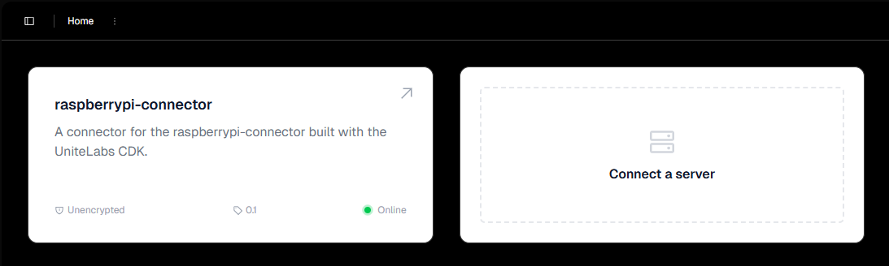

# Controlling the SiLA Client

1. Download the [SiLA Browser](https://gitlab.com/unitelabs/sila2/sila-browser/#stable-releases).

2. Select the raspberrypi-connector.

By default this already has some default features. For example the `SiLAService` feature through which the server info can be retrieved.