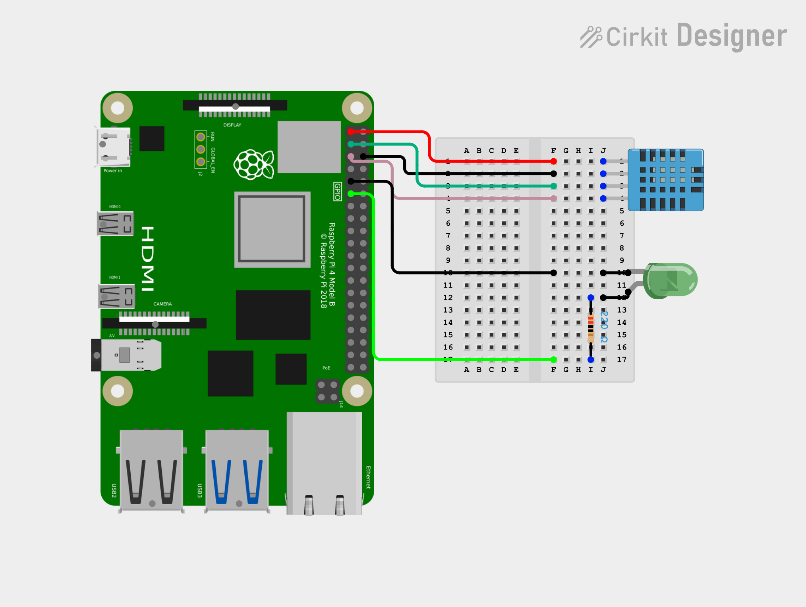

# SiLA 2 Workshop

## The Device



The device is a Raspberry Pi 4 connected to:
* An LED
* A BME280 sensor for temperature, humidity, and pressure

On the Raspoberry PI there is a server through which you can control the LED and get the sensor data. This server can be called through HTTP.

### 1. Check the Raspberry Pi connection

First, check that the Raspberry Pi is reachable from your computer:

```bash
ping raspberrypi.local
```

### 2. Call the server

The Raspberry Pi runs an HTTP server on port `5000`.

#### Get LED state

```bash
curl http://raspberrypi.local:5000/led
```

Response:

```json
# 0 = off, 1 = on
{
  "state": 0
}
```

#### Set LED state

**Turn the LED on:**

```bash
curl -X POST http://raspberrypi.local:5000/led -H "Content-Type: application/kson" -d "{\"state\":1}"
```

**Turn the LED off:**

```bash
curl -X POST http://raspberrypi.local:5000/led -H "Content-Type: application/json" -d "{\"state\":0}"
```

### 3. Read sensor data

Get the current measurements from the BME280 sensor:

```bash
curl http://raspberrypi.local:5000/bme280
```

Example response:

```json
{
  "humidity_percent": 56.26,
  "pressure_hpa": 1026.77,
  "temperature_c": 19.55
}
```
## SiLA Connector

## Prerequisites
- **Python 3.10+**: Ensure that Python 3.10 or later is installed. You can download Python from [python.org](python.org).
- **Git**: Ensure that Git is installed for version control. You can download the latest version from [git-scm.com](git-scm.com).
- **Cruft**: Ensure Cruft is installed.
```bash
pip install cruft
```
- **uv**: Ensure UV is installed as a package manager. You can download the latest version from [docs.astral.sh](https://docs.astral.sh/uv/getting-started/installation/).
- **VSCode**: Ensure VSCode is installed as an IDE. You can download the latest version from [code.visualstudio.com/download](https://code.visualstudio.com/download).

### Installation

Open a terminal in a location where you want the SiLA connector to be created.

1. Generate a new connector project using Cruft and fill in the variables:
```bash 
cruft create https://gitlab.com/unitelabs/cdk/connector-factory.git

[1/9] Select your connector name: raspberrypi-connector
[8/9] What type of communication does your device use?: 5 # because the server on the Raspberry pi is exposing an http api
[9/9] Select your environment management tool: 1
```

2. Open VSCOde in the location where you created your connector.
In the IDE the file structure will look like this:

```
raspberrypi-connector/
├── .venv/                      # Local Python environment
├── src/                        # Application source code
│   └── unitelabs/
│       └── raspberrypi_connector/
├── tests/                      # Automated tests
│
├── .gitignore                  # Defines what Git should ignore
├── README.md                   # Project overview and instructions
├── pyproject.toml              # Project configuration and dependencies
└── uv.lock                     # Exact dependency versions used by the project
```

3. Install the dependencies of the project with UV:
```bash
uv sync --all-extras
```

## Connecting the SiLA connector to the Raspberry PI

1. Open `src\unitelabs\raspberrypi_connector\io\raspberrypi_connector_protocol.py` and remove setting the of the host and port. This is because these variables will be caried through the kwargs. These arguments are passed into the `create_tcp_connection` method, and the SiLA connector will handle all network configuration and handling in the background.

```diff
...

class RaspberrypiConnectorProtocol(Protocol):
    """Underlying communication protocol for raspberrypi-connector."""

    def __init__(self, **kwargs):
-        kwargs["host"] = "localhost"  # FIXME: set device host
-        kwargs["port"] = 80  # FIXME: set device port
        super().__init__(create_tcp_connection, **kwargs)
```

2. Open `src\unitelabs\raspberrypi_connector\__init__.py` and add host and port to the configuration.
```diff
...

@dataclasses.dataclass
class RaspberrypiConnectorConfig(ConnectorBaseConfig):
    """Configuration for the raspberrypi-connector."""

+    "Address of the raspberry pi"
+    host: str = "raspberrypi.local"

+    "Port on which the server is running"
+    port: int = 5000 

    sila_server: SiLAServerConfig = dataclasses.field(
        default_factory=lambda: SiLAServerConfig(
            name="raspberrypi-connector",
            type="Example",
            description=(
                """
                A connector for the raspberrypi-connector built with the UniteLabs CDK.
                """
            ),
            version=str(__version__),
            vendor_url="https://unitelabs.io/",
        )
    )


async def create_app(config: RaspberrypiConnectorConfig) -> collections.abc.AsyncGenerator[Connector, None]:
    """Create the connector application."""

    app = Connector(config)

-    protocol = RaspberrypiConnectorProtocol()
+    protocol = RaspberrypiConnectorProtocol(host=config.host, port=config.port)
    await protocol.open()

    yield app

    protocol.close()
```

3. Generate config file. A file `config.json` will be created in the root of the project containing the new parameters and default values that were added in the `RaspberrypiConnectorConfig` class.
```bash
uv run config create --app unitelabs.raspberrypi_connector:create_app
```

4. Start the connector:
```bash
uv run connector start --app unitelabs.raspberrypi_connector:create_app
```